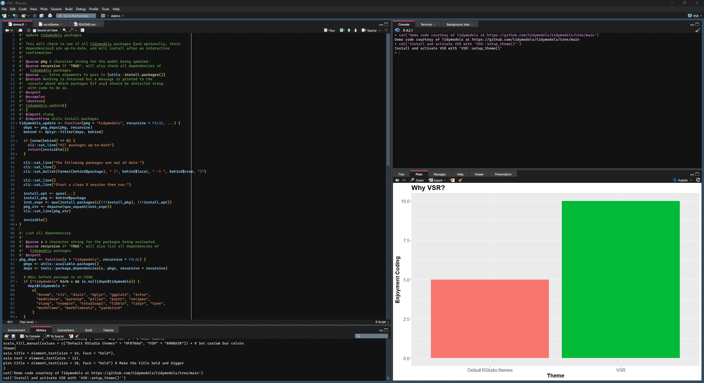

# VSR

VSR is a custom RStudio theme inspired by the default styling of VSCode. Statisticians and data scientists deserve the same aesthetically appealing IDE experience as traditional developers, but RStudio 's built-in themes fall short. VSR remediates this issue by introducing an aesthetically pleasing theme to enhance the R development experience without sacrificing the utility of RStudio.

{width="930"}

## Installing and activating VSR

Developers can install VSR 1 of 3 ways:

1.  **Use the package's built in setup function.** Install the VSR package with `devtools::install_github('scott-brown-1/VSR')`, then run `VSR::setup_theme()`.
2.  **Install the theme from rstudioapi.** Call `rstudioapi::addTheme('https://raw.githubusercontent.com/scott-brown-1/VSR/main/theme/vsr.rstheme', apply = TRUE)`.
3.  **Upload the `rstheme` file directly.** Download `theme/vsr.rstheme`, then upload the .rstheme file in RStudio under Tools \> Global Options \> Appearance \> Add... (under "Editor Theme")

**Important!** For best results, change the RStudio font to Cascadia Mono under Tools \> Global Options \> Appearance \> Editor Theme.

VSR is currently pending acceptance to CRAN.

## License

VSR is distributed under the GNU General Public License v3.0. See LICENSE for details.
